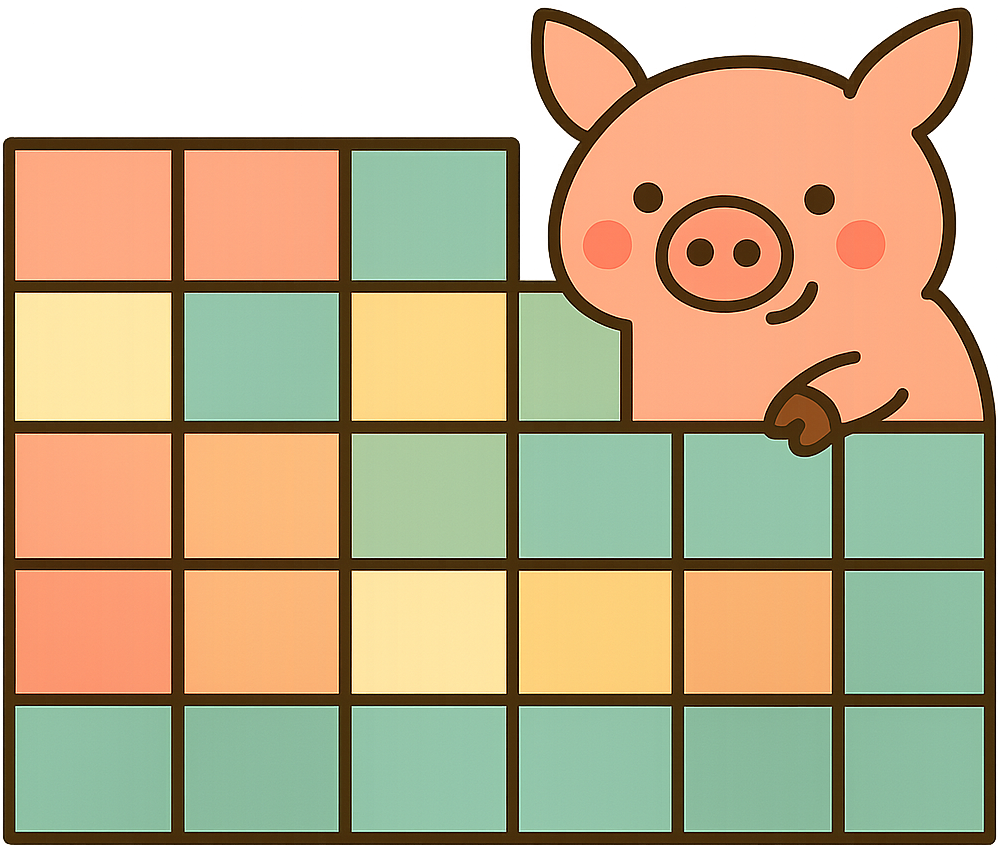

# Pack of random korrelations (pork)

Sample your own correlation matrices.

Randomly sampling correlation matrices is useful in various statistical applications, such as Monte Carlo simulations, where you need to generate random data that adheres to a specific correlation structure. However, there is still new research being done in this area, and the methods for generating these matrices can vary in complexity and computational efficiency. This repo aims to provide methods for sampling correlation matrices with various sturctures and properties.

## Installation

TODO

## Usage

TODO

# Available methods
1. TODO
2. TODO
